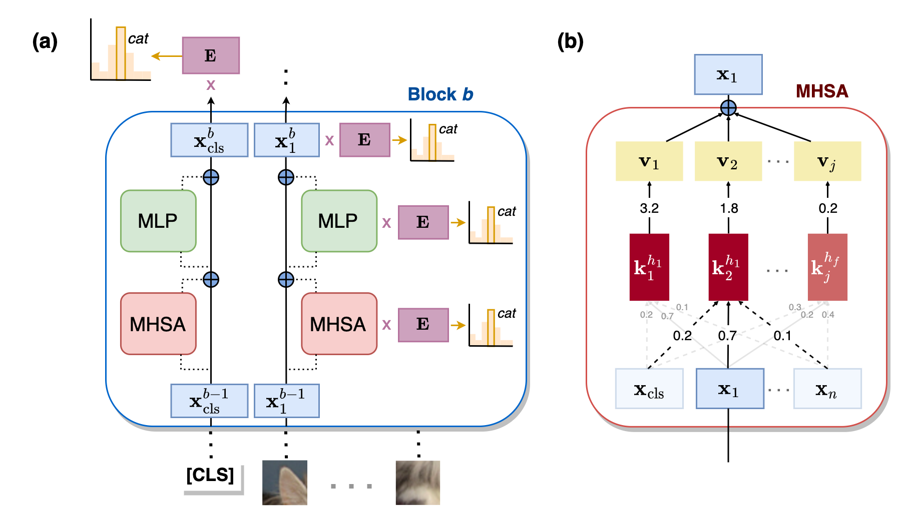

# Analyzing Vision Tranformers in Class Embedding Space (NeurIPS '23)
_by [Martina G. Vilas](https://martinagvilas.github.io/), Timothy Schaumlöffel and [Gemma Roig](http://www.cvai.cs.uni-frankfurt.de/team.html)_

__*Links*__: [Paper](https://arxiv.org/abs/2310.18969) | [Video presentation]() _(coming soon)_ | [Poster]() _(coming soon)_

> __Abstract__: Despite the growing use of transformer models in computer vision, a mechanistic
understanding of these networks is still needed. This work introduces a method to
reverse-engineer Vision Transformers trained to solve image classification tasks.
Inspired by previous research in NLP, we demonstrate how the inner representations
at any level of the hierarchy can be projected onto the learned class embedding
space to uncover how these networks build categorical representations for their pre-
dictions. We use our framework to show how image tokens develop class-specific
representations that depend on attention mechanisms and contextual information,
and give insights on how self-attention and MLP layers differentially contribute to
this categorical composition. We additionally demonstrate that this method (1) can
be used to determine the parts of an image that would be important for detecting
the class of interest, and (2) exhibits significant advantages over traditional linear
probing approaches. Taken together, our results position our proposed framework
as a powerful tool for mechanistic interpretability and explainability research.


<center><i>Schematic of our framework</i></center> 

## :paperclip: Contents

- [Tutorial](#tutorial)
- [Running the experiments](#running-the-experiments)
- [Citing our work](#citing-our-work)
- [Acknowledgments](#acknoledgements)

## Tutorial

_Coming soon!_

## Running the experiments

#### Step 1: Get a local working copy of this code
__1.1.__ Clone this repository in your local machine.

__1.2.__ Install the required software using conda, by running:
```
conda create --name vit-cls python=3.9
conda activate vit-cls
pip install -r requirements.txt
pip install .
```

#### Step 2: Download the dataset and model checkpoints
__2.1.__ Download the ImageNet-S dataset from [here](https://github.com/LUSSeg/ImageNet-S).

__2.2.__ Download the stimuli info file from [here](https://drive.google.com/drive/folders/1bkJeOGMxU2Ta0CrtKeY9JBLArwmQM9mu?usp=sharing), and place it inside the `ImageNet-S/ImageNetS919`
folder downloaded in the previous step.

__2.3.__ Download the model checkpoint folder from [here](https://drive.google.com/drive/folders/1bkJeOGMxU2Ta0CrtKeY9JBLArwmQM9mu?usp=sharing), and place it inside the project folder.

#### Step 3: Run experiments for extracting code
__3.1.__ Project hidden states to class embedding space and save key coefficients, by running:
```
python extractor.py -pp {PATH TO SOURCE CODE} -dp {PATH TO DATASET} -m {MODEL} -pretrained
```
- The model can be one of `vit_b_32`, `vit_b_16`, `vit_large_16`, `vit_cifar_16`, `vit_miil_16`, `deit_ensemble_16` (_Refinement_ model) and `vit_gap_16`.
- You can reproduce the results of the random model by removing the `-pretrained` flag.


__3.2.__ Run attention perturbation studies, by:
```
python perturbation/attn_perturbation.py -pp {PATH TO SOURCE CODE} -dp {PATH TO DATASET} -m vit_b_32 -pt {PERTURBATION TYPE}
```
- Perturbation type can be one of `self_only` or `no_cls`.

__3.3.__ Run context perturbation studies, by:
```
python perturbation/tokens_perturbation.py -pp {PATH TO SOURCE CODE} -dp {PATH TO DATASET} -m vit_b_32 -mt {MASK TYPE}
```
- Mask type can be one of `context` or `class label`.

__3.4.__ Run memory extractor, by:
```
python memories.py -pp {PATH TO SOURCE CODE} -dp {PATH TO DATASET} -m {MODEL} -lt {LAYER TYPE}
```
- Layer type can be one of `attn` or `mlp`.

__3.5.__ Run comparison with a linear probing approach, by:
```
python linear_probing/prober.py -pp {PATH TO SOURCE CODE} -dp {PATH TO DATASET} -l {LAYER INDEX}
```

#### Step 4: Reproduce the results
After running the above code, 
head to the [notebooks](https://github.com/martinagvilas/vit-cls_emb/tree/main/notebooks) section to reproduce and visualize the reported results.
 
## Citing our work
Please cite this work as:
```
@misc{vilas2023analyzing,
      title={Analyzing Vision Transformers for Image Classification in Class Embedding Space}, 
      author={Martina G. Vilas and Timothy Schaumlöffel and Gemma Roig},
      year={2023},
      eprint={2310.18969},
      archivePrefix={arXiv},
      primaryClass={cs.CV}
}
```


## Acknoledgements
- The pre-trained models are extracted from the [timm](https://github.com/huggingface/pytorch-image-models/tree/main) library.
- Our readme is inspired by [IPViT](https://github.com/Muzammal-Naseer/IPViT).
